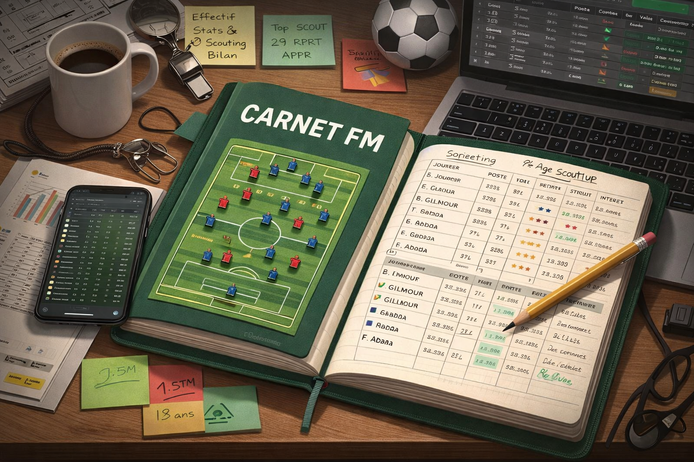

  

# 📘 Carnet FM – Football Manager

**Carnet FM** est un outil web personnel destiné à accompagner une carrière Football Manager, saison après saison.

Il permet de centraliser :
- la préparation de saison
- la gestion de l’effectif
- les statistiques
- le scouting (adultes et jeunes)
- le bilan de fin de saison
- la sauvegarde et l’historique des carrières

👉 Pensé comme un **carnet de coach**, simple, rapide et sauvegardé automatiquement.

---

🌐 **Accéder à l’outil en ligne**  
👉 https://clemennt.github.io/football-notebook/

---

## 🚀 Fonctionnalités

- 📋 Présentation de la saison
- 👥 Gestion complète de l’effectif
- 📊 Statistiques avec mise en forme automatique
- 🔍 Scouting joueurs
- 🎓 Scouting jeunes (≤ 18 ans)
- 📑 Bilan de la saison structuré
- ⚙️ Paramètres (export, sauvegarde, reset)

---

## 💾 Sauvegarde
- Sauvegarde automatique via **localStorage**
- Aucune base de données
- Fonctionne hors ligne

---

## 📄 Export
- Export des données en **JSON** (recommandé)
- Export PDF disponible (en cours d’amélioration)

---

## 📘 Documentation
👉 **Guide complet d’utilisation :**  
➡️ [GUIDE.md](GUIDE.md)

---

## 🛠️ Technologies
- HTML5
- CSS3
- JavaScript (vanilla)
- localStorage

---

## 💬 Suggestions & Support

Tu as une idée, un bug à signaler ou une suggestion d’amélioration ?

- 🐛 Ouvre une **Issue GitHub** (recommandé pour les bugs)
- 💬 Rejoins le Discord pour discuter et proposer des idées :  
  👉 https://discord.gg/rtfST4DnJm
---

## ⚠️ Remarque
Ce projet est un **outil personnel**, non affilié à Sports Interactive ou Football Manager.

---

Bon jeu ⚽
